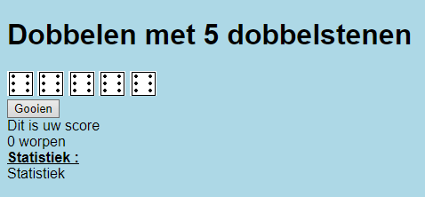
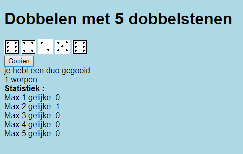

# Exercise Dobbelspel

Maak een webpagina die de gebruiker toelaat om via een knop te dobbelen. Bij het aanklikken va nde knop worden 5 dobbelstenen gerold.

Daarnaast wordt telkens de score getoond *(telkens de hoogste score van de tabel hieronder)*

| score | voorwaarde |
|---|---|
|Dubbel| 2 gelijke dobbelstenen gegooid (2 gelijke dobbels is 1 dubbel) |
|Trio|3 gelijke dobbelstenen|
|Quattro|4 gelijke dobbelstenen|
|Cinquo|5 gelijke dobbelstenen|

De gebruiker ziet zijn aantal worpen alsook een statistiek die weergeeft hoeveel keer hij welke score heeft gegooid. De dobbelstenen worden als afbeelding getoond deze kan je terugvinden in de **Resources** folder.

<u>Start scherm:</u>

<u>Werking:</u>

