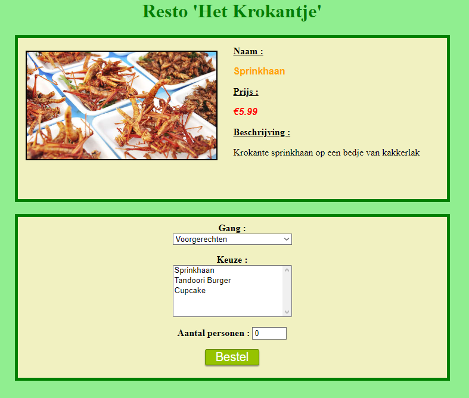
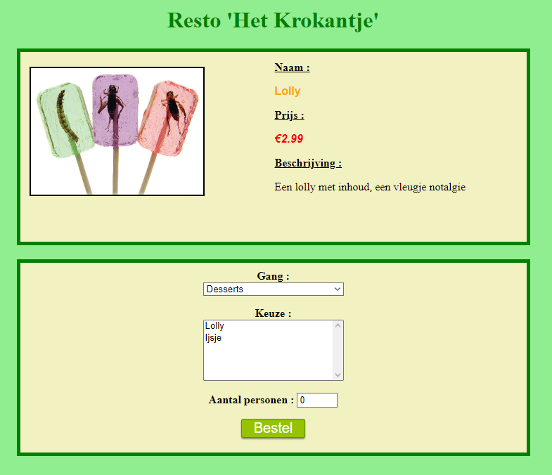
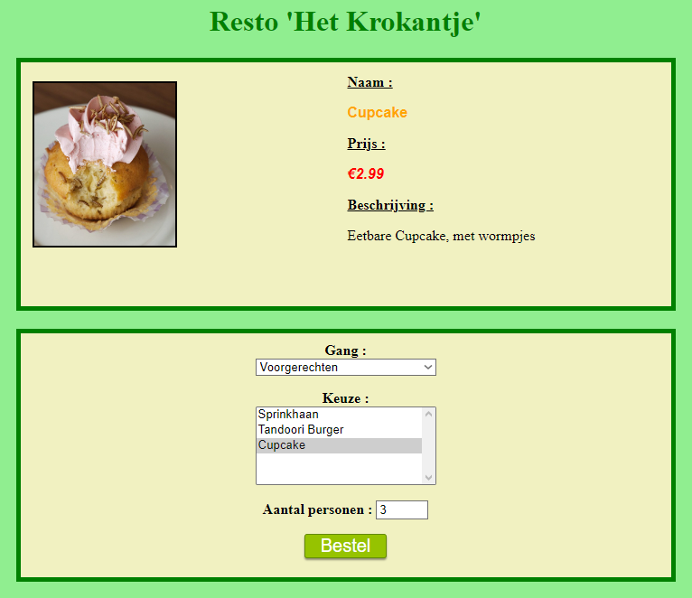
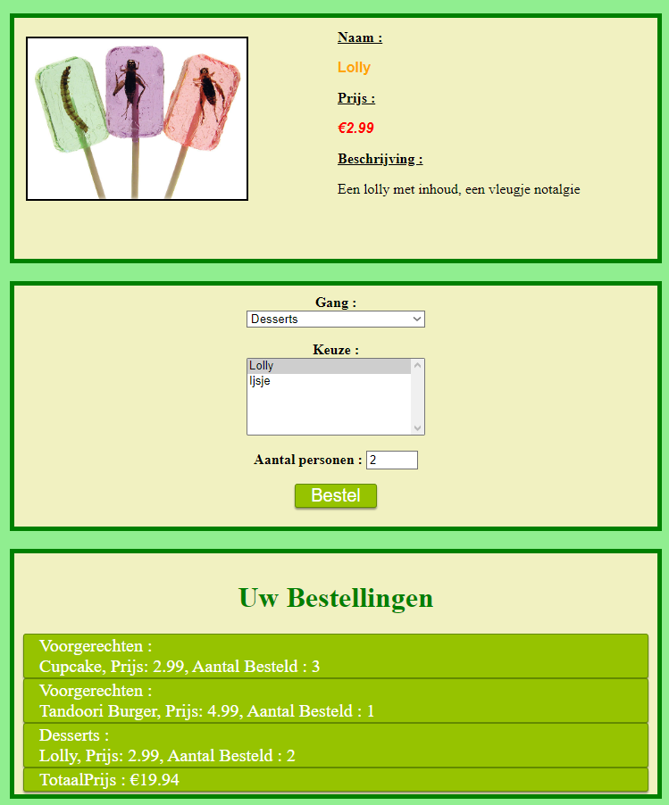
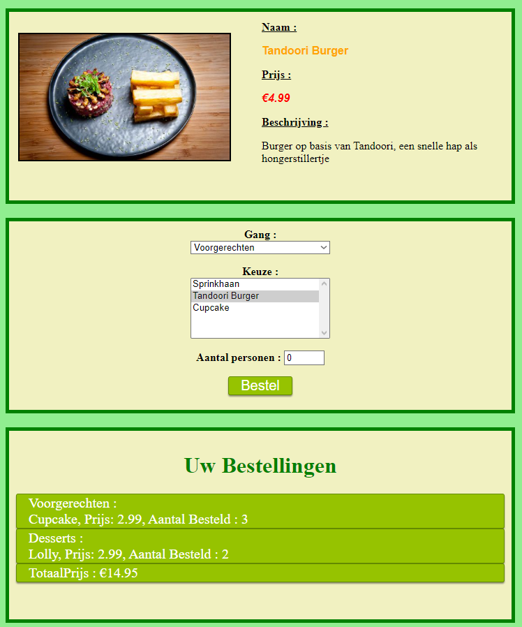

# Exercise het krokantje

Maak een website voor het selecteren van gerechten in het restaurant "het krokantje".

De foto's van de gerechten kan je terugvinden in **Resources** folder onder **afbeeldingen**. De gebruikte foto en tekst van ieder gerecht kan je teugvinden onder **Resources** -> **GerechtenBeschrijving.xlsx**.

> **TIP** Bewaar de gerechten als JSON formaat in een variabele. validaar uw JSON met een online [validator](https://jsonlint.com) 

Bekijk de werking van het website op de volgende pagina's

## functionaliteiten
- Bij het opstarten van de website wordt het eerste gerecht en zijn beschrijving getoond. In de selectievakjes kan een gebruiker een gang en een keuze maken (zie start scherm)

- Bij het wijzigenvan de gang worden de gerechten getoond die horen bij deze gang, standaard wordt het eerste gerecht weergegeven.
- De gebruiker krijgt de mogelijkheid te bestellen, en geeft hiervoor het aantal personen in (controle bij de ingave) waarna hij/zij op de knop bestellen klikt (zie bestelling voorbereiden).
- Bij geldige ingave wordt de bestelling onderaan het scherm weergegeven. (zie bestel), De gebruiker heeft de mogelijkheid deze nog te annuleren, bij selectie ven het gerecht en aantal personen = 0. Dan wordt die lijn in de bestelling verwijderd. (zie wijzigen bestelling)
- Helemaal onderaand wordt de totaal prijs weergegeven van de bestelling. Deze wordt uiteraard aangepast aan de bestellingen die werden gemaakt, en de wijzigingen die de gebruiker uitvoert. (zie bestel)

**Start scherm**

Dit is het startscherm van de website, de standaard is de gang voorgerechten geselecteerd en het eerste gerecht in dit geval Sprinkhaan.

**Wijzigen keuze**

Wanneer we de gang veranderen wordt ook telkenshet eerste gerecht geselecteerd.

**bestelling voorbereiden**

Hier kan je zien dat ik het aantal personen invul alvorens ik op bestel druk. Zorg ook voor de nodige controle wanneer er geen getal wordt ingevuld.

**bestel**

Telkens wanneer we op bestel drukken wordt het gerecht en het aantal weergegeven onder bestellingen.

**wijzigen bestelling**

Hier kan je zien dat we de bestelling kunnen aanpassen door een gerecht te selecteren en het aantal personen op 0 te plaatsen, wanneer we dan op de knop bestel drukken zal het gerecht van de bestelling verwijdert worden.
